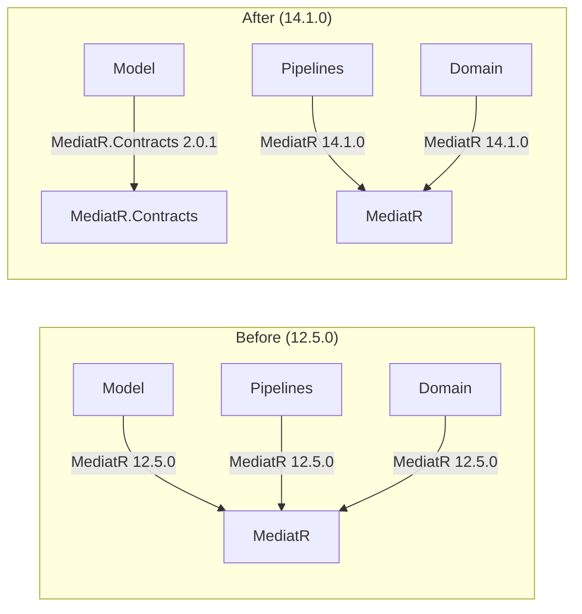
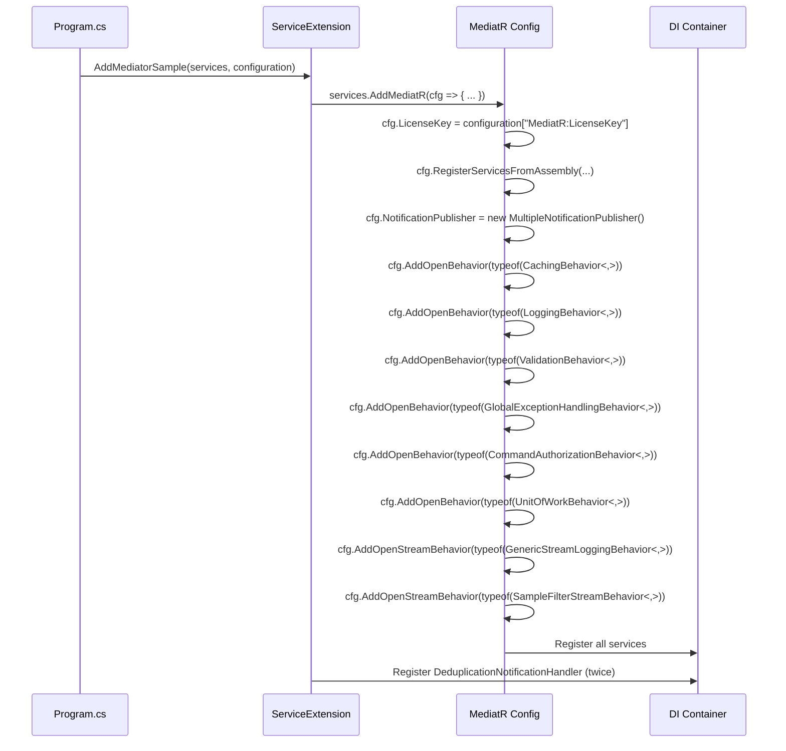

# Design Document: MediatR 14 Upgrade

## Overview

This design covers the upgrade of the MediatR Playground project from MediatR 12.5.0 to MediatR 14.1.0. The upgrade touches four main areas:

1. **Package references** — Domain and Pipelines projects move to MediatR 14.1.0; Model project switches to the lightweight MediatR.Contracts 2.0.1 package.
2. **License key configuration** — MediatR 14.1.0 requires a license key, configured via `IConfiguration` and passed through the `MediatRServiceConfiguration.LicenseKey` property.
3. **Behavior registration modernization** — All `services.AddTransient(typeof(IPipelineBehavior<,>), ...)` calls are replaced with `cfg.AddOpenBehavior(typeof(...))` and `cfg.AddOpenStreamBehavior(typeof(...))` inside the `AddMediatR` configuration lambda.
4. **Notification handler de-duplication demo** — A new `DeduplicationNotification` / `DeduplicationNotificationHandler` pair demonstrates MediatR 14's built-in handler de-duplication. The handler is intentionally registered twice to show that MediatR only invokes it once per publish.

All existing pipeline behavior execution order, notification publishing strategies, and endpoint behavior remain unchanged.

## Architecture

The project's dependency flow stays the same:

```
API → Domain → Pipelines → Model
                         → Persistence
                         → FakeAuth.Service
```

### Package Reference Changes



### Registration Flow



## Components and Interfaces

### Modified Components

#### 1. ServiceExtension (`MediatR.Playground.Domain/ServiceExtension.cs`)

**Current signature:**
```csharp
public static IServiceCollection AddMediatorSample(this IServiceCollection services)
```

**New signature:**
```csharp
public static IServiceCollection AddMediatorSample(
    this IServiceCollection services,
    IConfiguration configuration)
```

Changes:
- Accepts `IConfiguration` parameter to read the license key.
- Sets `cfg.LicenseKey = configuration["MediatR:LicenseKey"]` inside the `AddMediatR` lambda.
- Replaces all `services.AddTransient(typeof(IPipelineBehavior<,>), typeof(...))` with `cfg.AddOpenBehavior(typeof(...))`.
- Replaces all `services.AddTransient(typeof(IStreamPipelineBehavior<,>), typeof(...))` with `cfg.AddOpenStreamBehavior(typeof(...))`.
- Adds two explicit `services.AddTransient<INotificationHandler<DeduplicationNotification>, DeduplicationNotificationHandler>()` calls after the `AddMediatR` block to simulate duplicate registration.

#### 2. Program.cs (`MediatR.Playground.API/Program.cs`)

Changes:
- Passes `builder.Configuration` to `AddMediatorSample`:
  ```csharp
  builder.Services.AddMediatorSample(builder.Configuration);
  ```

#### 3. NotificationEndpoint (`MediatR.Playground.API/Endpoints/NotificationEndpoint.cs`)

Changes:
- Adds a new `POST /Notifications/DeduplicationNotification` route that creates and publishes a `DeduplicationNotification`, returning `{ Id, NotificationTime, Type = "Deduplication" }`.

#### 4. Configuration Files

**`appsettings.json`** — adds empty placeholder:
```json
{
  "MediatR": {
    "LicenseKey": ""
  }
}
```

**`appsettings.Development.json`** — adds actual license key:
```json
{
  "MediatR": {
    "LicenseKey": "<actual-license-key>"
  }
}
```

#### 5. Project Files (.csproj)

| Project | Before | After |
|---------|--------|-------|
| `MediatR.Playground.Domain` | `MediatR 12.5.0` | `MediatR 14.1.0` |
| `MediatR.Playground.Pipelines` | `MediatR 12.5.0` | `MediatR 14.1.0` |
| `MediatR.Playground.Model` | `MediatR 12.5.0` | `MediatR.Contracts 2.0.1` |

### New Components

#### 6. DeduplicationNotification (`MediatR.Playground.Model/Notifications/DeduplicationNotification.cs`)

```csharp
namespace MediatR.Playground.Model.Notifications;

public record DeduplicationNotification : INotification
{
    public Guid Id { get; set; }
    public DateTime NotificationTime { get; set; }
}
```

Follows the same pattern as `SampleNotification` — a record implementing `INotification` with `Id` and `NotificationTime` properties.

#### 7. DeduplicationNotificationHandler (`MediatR.Playground.Domain/NotificationHandler/Deduplication/DeduplicationNotificationHandler.cs`)

```csharp
namespace MediatR.Playground.Domain.NotificationHandler.Deduplication;

internal class DeduplicationNotificationHandler(
    ILogger<DeduplicationNotificationHandler> logger)
    : INotificationHandler<DeduplicationNotification>
{
    private static readonly ConcurrentDictionary<Guid, int> InvocationCounter = new();

    public Task Handle(DeduplicationNotification notification, CancellationToken cancellationToken)
    {
        var count = InvocationCounter.AddOrUpdate(notification.Id, 1, (_, c) => c + 1);

        logger.LogInformation(
            "Handler: {Handler} | Id={Id} | NotificationTime={Time} | InvocationCount={Count}",
            nameof(DeduplicationNotificationHandler),
            notification.Id,
            notification.NotificationTime,
            count);

        return Task.CompletedTask;
    }
}
```

Key design decisions:
- **Static `ConcurrentDictionary<Guid, int>`** — thread-safe counter keyed by notification ID. `AddOrUpdate` atomically increments the count.
- **Primary constructor** — matches the existing handler style (e.g., `SampleNotificationFirstHandler`).
- **`internal` visibility** — consistent with other handlers in the Domain project.
- When MediatR 14 de-duplication is active, the count will always be 1 per publish call despite the handler being registered twice.

### Documentation Components

#### 8. Migration Guide (`docs/upgrade-mediatr-14.md`)

New markdown file covering:
- Package version changes per project
- License key configuration approach
- `AddOpenBehavior` / `AddOpenStreamBehavior` migration
- MediatR.Contracts separation pattern
- Notification handler de-duplication feature

#### 9. Updated `docs/notifications.md`

- New "Notification Handler De-duplication" section explaining the MediatR 14 feature
- `DeduplicationNotification` added to the notification models table
- `POST /Notifications/DeduplicationNotification` added to the API endpoints table

#### 10. Updated `docs/pipelines.md`

- Registration Order section updated to show `cfg.AddOpenBehavior(typeof(...))` pattern
- Old `services.AddTransient(typeof(IPipelineBehavior<,>), ...)` pattern noted as the previous approach

## Data Models

### DeduplicationNotification

| Property | Type | Description |
|----------|------|-------------|
| `Id` | `Guid` | Unique identifier for the notification instance |
| `NotificationTime` | `DateTime` | Timestamp when the notification was created |

This follows the exact same shape as `SampleNotification` and `SampleParallelNotification`. It implements `INotification` directly (no marker interface), so the `MultipleNotificationPublisher` will route it through the default `ForeachAwaitPublisher` (sequential execution).

### DeduplicationNotificationHandler Static State

| Field | Type | Description |
|-------|------|-------------|
| `InvocationCounter` | `ConcurrentDictionary<Guid, int>` | Static, thread-safe dictionary tracking how many times the handler was invoked per notification ID |

The static counter persists across requests for the lifetime of the application process. This is intentional for the demo — it allows observing that repeated calls to the endpoint always show `InvocationCount=1` for each unique notification ID, proving de-duplication works.

### Configuration Schema

The license key is stored in the standard ASP.NET Core configuration hierarchy:

```json
{
  "MediatR": {
    "LicenseKey": "<value>"
  }
}
```

Accessed via `IConfiguration["MediatR:LicenseKey"]`. The empty placeholder in `appsettings.json` is overridden by the actual value in `appsettings.Development.json` per the standard configuration layering.


## Error Handling

### License Key Errors

If the license key is missing or empty, MediatR 14.1.0 emits a warning log via the `LuckyPennySoftware.MediatR.License` logging category. The application still starts and functions — the license key is not enforced at startup. No custom error handling is needed.

The design uses the standard ASP.NET Core configuration layering:
- `appsettings.json` has an empty placeholder (`"LicenseKey": ""`)
- `appsettings.Development.json` provides the actual key
- If neither provides a value, `IConfiguration["MediatR:LicenseKey"]` returns `null`, which MediatR treats as "no license key set"

### Duplicate Handler Registration

The `DeduplicationNotificationHandler` is intentionally registered twice via explicit `services.AddTransient` calls. MediatR 14.1.0's built-in notification handler de-duplication ensures the handler executes only once per `Publish` call, even with duplicate registrations. No error is thrown — this is the expected behavior being demonstrated.

### Invocation Counter Thread Safety

The `ConcurrentDictionary<Guid, int>` with `AddOrUpdate` handles concurrent access safely. Since the counter is static and persists for the application lifetime, there is no risk of data loss from concurrent notification handling. No additional error handling is needed.

### Build Errors from Package Migration

If the MediatR.Contracts package does not provide an interface used in the Model project, the build will fail with a compile error. This is caught during development — all existing interfaces (`IRequest`, `INotification`, `IStreamRequest`, `INotificationHandler`) are included in MediatR.Contracts 2.0.1.

## Testing Strategy

### Why Property-Based Testing Does Not Apply

This feature is a package upgrade and DI registration migration. The changes are:
- NuGet package version bumps (configuration)
- DI registration pattern changes from `AddTransient` to `AddOpenBehavior` (wiring)
- License key configuration (setup)
- A simple notification handler with a `ConcurrentDictionary.AddOrUpdate` call (trivial logic)
- Documentation updates (non-code)

None of these involve pure functions with meaningful input variation. There are no parsers, serializers, data transformations, or algorithms where generating 100+ random inputs would reveal edge cases. Example-based unit tests and integration tests are the appropriate strategies.

### Recommended Test Approach

#### Smoke Tests (Build Verification)

The primary verification for requirements 1–6 is that the solution builds successfully:

```bash
dotnet build src/MediatR.Playground.sln
```

A successful build confirms:
- Domain and Pipelines projects compile against MediatR 14.1.0
- Model project compiles against MediatR.Contracts 2.0.1
- `AddMediatorSample` accepts `IConfiguration` and `Program.cs` passes it correctly
- `DeduplicationNotification` is a valid `INotification` implementation
- `DeduplicationNotificationHandler` implements `INotificationHandler<DeduplicationNotification>`

#### Unit Tests (Handler Logic)

If a test project is added (xUnit, per project conventions):

1. **Invocation counter test** — Create a `DeduplicationNotificationHandler` with a mock `ILogger`, call `Handle` with two different notification IDs, verify each ID has count=1. Call again with the first ID, verify count=2.
2. **Logging verification test** — Call `Handle` and verify the logger receives a message containing the handler name, notification ID, time, and count.

#### Integration Tests (End-to-End Verification)

Using `WebApplicationFactory<Program>`:

1. **De-duplication test** — `POST /Notifications/DeduplicationNotification`, verify response has `Type = "Deduplication"` and the handler's static counter shows count=1 (not 2, despite double registration).
2. **Pipeline order test** — Send a command request, verify log output shows behaviors executing in the same order as before the migration.
3. **Endpoint existence test** — Verify `POST /Notifications/DeduplicationNotification` returns 200 OK with the expected JSON shape (`Id`, `NotificationTime`, `Type`).

#### Documentation Verification

Documentation requirements (10–12) are verified by manual review. The migration guide, notifications docs, and pipelines docs are checked for completeness against the acceptance criteria.
