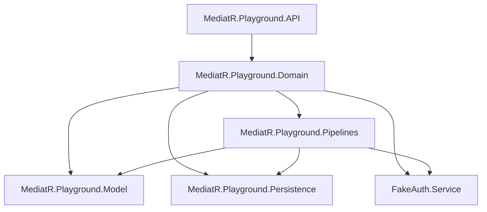

# Design Document — MediatR Upgrade and Documentation

## Overview

This design covers two main workstreams for the MediatR Playground repository:

1. **Framework and Package Upgrades**: Migrate from .NET 9 to .NET 10 (LTS, released November 2025, supported until November 2028), upgrade MediatR from 12.4.1 to 12.5.0 (the last Apache-2.0 licensed version), and update all NuGet dependencies to their latest stable versions.

2. **Documentation Restructuring**: Create a `docs/` folder with dedicated Markdown files for each topic implemented in the project, update the main README with a table of contents, project structure overview, and links to both the docs folder and the author's Medium articles.

The upgrade is straightforward — all projects currently target `net9.0` and use older package versions. The .NET 10 upgrade requires updating `TargetFramework` in all `.csproj` files and bumping Microsoft.* packages to their 10.x counterparts. MediatR 12.5.0 is a minor bump from 12.4.1 with no breaking API changes. Third-party packages (FluentValidation, FusionCache, Bogus, Swashbuckle) all have newer stable versions available.

The documentation effort organizes existing knowledge from the codebase into navigable, topic-specific files. Each doc file covers one pattern or feature, references the relevant source code, and links to the corresponding Medium article for deeper reading. The Priority Notification Publisher documentation is entirely new content since no Medium article exists for it.

## Architecture

The existing solution architecture remains unchanged. The upgrade does not alter the project dependency graph or introduce new projects.



### Documentation Structure

```
repository-root/
├── README.md                          # Updated with TOC, project structure, topic summaries
├── docs/
│   ├── pipelines.md                   # MediatR Pipelines (IPipelineBehavior)
│   ├── unit-of-work.md                # Unit of Work pattern with MediatR
│   ├── exception-handling.md          # Exception handling via IRequestExceptionHandler
│   ├── global-exception-handling.md   # Global exception handling via IPipelineBehavior
│   ├── notifications.md               # Notifications and notification publishers
│   ├── priority-notification-publisher.md  # Priority-based notification publisher (new)
│   ├── stream-requests.md             # Stream requests and stream pipelines
│   └── caching.md                     # Caching pipeline with FusionCache
└── src/
    └── (existing project structure unchanged)
```

## Components and Interfaces

### Upgrade Component

The upgrade touches all six `.csproj` files. No new components or interfaces are introduced.

**Target Framework Change** (all projects):
- `net9.0` → `net10.0`

**Package Version Changes**:

| Package | Current | Target | Project(s) |
|---------|---------|--------|------------|
| MediatR | 12.4.1 | 12.5.0 | Model, Domain, Pipelines |
| FluentValidation | 11.11.0 | latest stable (12.x) | Domain, Pipelines |
| FluentValidation.DependencyInjectionExtensions | 11.11.0 | latest stable (12.x) | Domain |
| ZiggyCreatures.FusionCache | 2.1.0 | latest stable (2.x) | Pipelines |
| Bogus | 35.6.2 | latest stable (35.x) | FakeAuth.Service |
| Swashbuckle.AspNetCore | 7.2.0 | latest stable compatible with .NET 10 | API |
| Microsoft.AspNetCore.OpenApi | 9.0.2 | 10.x | API |
| Microsoft.EntityFrameworkCore.InMemory | 9.0.2 | 10.x | Persistence |
| Microsoft.Extensions.Logging.Abstractions | 9.0.2 | 10.x | Domain |
| Microsoft.Extensions.DependencyInjection.Abstractions | 9.0.2 | 10.x | Persistence |

**Design Decision**: Use `dotnet add package` commands to resolve exact latest stable versions at upgrade time rather than hardcoding version numbers in this design. This ensures the actual latest versions are picked up when the tasks are executed.

**Design Decision**: MediatR is pinned to 12.5.0 specifically. Versions 13.0+ use the commercial RPL-1.5 license. The design explicitly avoids upgrading past this version.

### Documentation Component

Each documentation file follows a consistent structure:

1. **Title and introduction** — what the pattern/feature is
2. **How it works** — explanation of the implementation approach with references to source files
3. **Code references** — pointers to the relevant classes and interfaces in the project
4. **Medium article link** (where applicable) — "For further reading" section linking to the author's article

The documentation describes the patterns as implemented in the codebase. It does not reproduce Medium article content — it provides repository-specific documentation that complements the articles.

### README Component

The updated README will have these sections:

1. **Title and introduction** (updated)
2. **Table of Contents** with internal anchors and links to `docs/` files
3. **Package versions** section noting .NET 10, MediatR 12.5.0 (Apache-2.0), and other key versions
4. **Project structure** describing each project's role
5. **Topic summaries** — brief intro for each documented topic with link to `docs/` file
6. **Medium articles** — consolidated list of article links
7. **Swagger endpoints** — updated list of all available endpoints
8. **Getting started / Testing the application** section

## Data Models

No data model changes. The upgrade and documentation work does not modify any domain models, commands, queries, notifications, or persistence entities.

## Error Handling

### Upgrade Error Handling

- If the .NET 10 upgrade introduces breaking changes in any API surface (e.g., removed or changed methods in Microsoft.* packages), the source code will be adapted to use the new APIs.
- If FluentValidation 12.x introduces breaking changes from 11.x, validators and the `ValidationBehavior` pipeline will be updated accordingly.
- If Swashbuckle has compatibility issues with .NET 10, the latest compatible version will be used (potentially a major version bump).
- Build verification (`dotnet build`) is the primary validation gate — the solution must compile cleanly after all upgrades.

### Documentation Error Handling

- All internal links (README → docs/, docs/ → source files) will use relative paths to ensure they work on GitHub and locally.
- Medium article links will be preserved exactly as they appear in the current README.

## Testing Strategy

### Why Property-Based Testing Does Not Apply

This feature consists of:
1. **Package version upgrades** — configuration changes validated by compilation
2. **Markdown documentation creation** — static content with no executable logic

There are no pure functions, data transformations, parsers, serializers, or business logic being created or modified. The acceptance criteria are all about build success, file existence, and content structure — none of which benefit from property-based testing.

### Verification Approach

**For package upgrades (Requirements 1-3)**:
- **Build verification**: Run `dotnet build` on the solution after all upgrades to confirm compilation succeeds
- **Manual smoke test**: Start the application and verify Swagger UI loads with all endpoints visible

**For documentation (Requirements 4-13)**:
- **Link verification**: Manually verify that all relative links between README and docs/ files resolve correctly
- **Content review**: Review each documentation file against its acceptance criteria to ensure all required topics are covered
- **Consistency check**: Verify tone and style consistency across all documentation files

No automated test suite is needed for this feature since it produces no testable application code.
