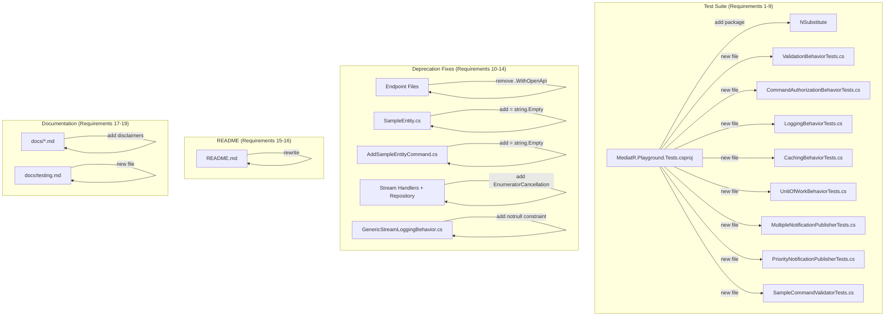
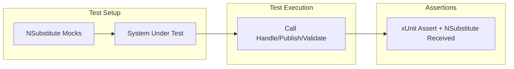

# Design Document

## Overview

This design covers four areas of improvement for the MediatR Playground project:

1. **Unit Test Suite** — Isolated unit tests using NSubstitute for all pipeline behaviors (`ValidationBehavior`, `CommandAuthorizationBehavior`, `LoggingBehavior`, `CachingBehavior`, `UnitOfWorkBehavior`), notification publishers (`MultipleNotificationPublisher`, `PriorityNotificationPublisher`), and the `SampleCommandValidator`. These complement the 11 existing baseline smoke tests in `BaselineSmokeTests.cs`.
2. **Deprecation Fixes** — Eliminate all compiler warnings: ASPDEPR002 (remove deprecated `WithOpenApi()` calls), CS8618 (initialize non-nullable properties), CS8425 (add `[EnumeratorCancellation]` attributes), CS8714 (fix nullability constraint on `GenericStreamLoggingBehavior`).
3. **README Restructuring** — New title "MediatR Pipelines Playground", reordered sections, version note, and removal of inline testing section.
4. **Documentation Updates** — AI-generated disclaimers with article links in existing `docs/` files, and a new `docs/testing.md` file.

### Design Decisions

- **NSubstitute over Moq**: NSubstitute provides a cleaner, more readable syntax for .NET mocking. It uses natural method call syntax instead of lambda expressions, making tests easier to read and maintain.
- **Isolated unit tests over integration tests**: The existing `BaselineSmokeTests` already cover DI wiring and end-to-end flows. The new tests focus on individual component behavior with mocked dependencies, testing each branch and edge case in isolation.
- **Remove `WithOpenApi()` rather than replace**: Per [Microsoft's migration guidance](https://learn.microsoft.com/en-us/dotnet/core/compatibility/aspnet-core/10/withopenapi-deprecated), the recommended action is to remove `.WithOpenApi()` calls. The project uses Swashbuckle for OpenAPI document generation, which handles endpoint metadata independently. No replacement call is needed.
- **`= string.Empty` for CS8618 fixes**: Using default initializers (`= string.Empty`) is the least invasive fix for non-nullable string properties that lack initialization. The `required` keyword is an alternative but would be a breaking change for existing code that constructs these objects without setting the property.

## Architecture

The changes span four independent areas that don't interact with each other:



### Test Architecture

Each test class follows the Arrange-Act-Assert pattern with NSubstitute mocks:



Pipeline behavior tests mock:
- `RequestHandlerDelegate<TResponse>` (the `next()` delegate)
- `ILogger<T>` (logging verification)
- Domain-specific dependencies (`IValidator<T>`, `IAuthService`, `IFusionCache`, `IUnitOfWork`)

Notification publisher tests mock:
- `NotificationHandlerExecutor` instances with controlled `HandlerCallback` delegates
- Handler instances implementing `IPriorityNotificationHandler` with specific priority values

## Components and Interfaces

### New Test Files

| File | Tests | Dependencies Mocked |
|------|-------|-------------------|
| `ValidationBehaviorTests.cs` | `ValidationBehavior<TRequest, TResponse>` | `IValidator<TRequest>`, `RequestHandlerDelegate<TResponse>` |
| `CommandAuthorizationBehaviorTests.cs` | `CommandAuthorizationBehavior<TRequest, TResponse>` | `IAuthService`, `RequestHandlerDelegate<TResponse>` |
| `LoggingBehaviorTests.cs` | `LoggingBehavior<TRequest, TResponse>` | `ILogger<LoggingBehavior>`, `RequestHandlerDelegate<TResponse>` |
| `CachingBehaviorTests.cs` | `CachingBehavior<TRequest, TResponse>` | `ILogger<CachingBehavior>`, `IFusionCache`, `RequestHandlerDelegate<TResponse>` |
| `UnitOfWorkBehaviorTests.cs` | `UnitOfWorkBehavior<TRequest, TResponse>` | `ILogger<UnitOfWorkBehavior>`, `IUnitOfWork`, `IDbContextTransaction`, `RequestHandlerDelegate<TResponse>` |
| `MultipleNotificationPublisherTests.cs` | `MultipleNotificationPublisher` | `NotificationHandlerExecutor` callbacks |
| `PriorityNotificationPublisherTests.cs` | `PriorityNotificationPublisher` | `NotificationHandlerExecutor` callbacks, handler instances with `Priority` property |
| `SampleCommandValidatorTests.cs` | `SampleCommandValidator` | None (direct FluentValidation testing) |

### Modified Files — Deprecation Fixes

| File | Change | Warning Fixed |
|------|--------|--------------|
| `StreamRequestEndpoint.cs` | Remove 2 `.WithOpenApi()` calls | ASPDEPR002 |
| `RequestsAndCommandEndpoints.cs` | Remove 2 `.WithOpenApi()` calls | ASPDEPR002 |
| `NotificationEndpoint.cs` | Remove 3 `.WithOpenApi()` calls | ASPDEPR002 |
| `TransactionEndpoints.cs` | Remove 3 `.WithOpenApi()` calls | ASPDEPR002 |
| `ExceptionsEndpoints.cs` | Remove 3 `.WithOpenApi()` calls | ASPDEPR002 |
| `SampleEntity.cs` | Add `= string.Empty` to `Description` | CS8618 |
| `AddSampleEntityCommand.cs` | Add `= string.Empty` to `Description` | CS8618 |
| `EntityFrameworkRepository.cs` | Add `[EnumeratorCancellation]` to `GetStream` cancellationToken param | CS8425 |
| `StreamEntity/SampleStreamQueryHandler.cs` | Add `[EnumeratorCancellation]` to `Handle` cancellationToken param | CS8425 |
| `StreamEntityWithFilter/SampleStreamQueryHandler.cs` | Add `[EnumeratorCancellation]` to `Handle` cancellationToken param | CS8425 |
| `GenericStreamLoggingBehavior.cs` | Add `where TRequest : notnull` constraint | CS8714 |

### Modified Files — Documentation

| File | Change |
|------|--------|
| `README.md` | New title, reordered sections, version note at top, Package Versions at bottom, no inline testing section, link to `docs/testing.md` |
| `docs/testing.md` | New file with test suite docs, `.http` file description, simplified PS1 script usage |
| `docs/pipelines.md` | Add AI-generated disclaimer with article link |
| `docs/unit-of-work.md` | Add AI-generated disclaimer with article link |
| `docs/exception-handling.md` | Add AI-generated disclaimer with article link |
| `docs/global-exception-handling.md` | Add AI-generated disclaimer with article link (shares exception handling article) |
| `docs/notifications.md` | Add AI-generated disclaimer with article link |
| `docs/priority-notification-publisher.md` | Add AI-generated disclaimer with article link (shares notifications article) |
| `docs/stream-requests.md` | Add AI-generated disclaimer with article link |
| `docs/caching.md` | Add AI-generated disclaimer with article link |

### Test Helper Types

To test generic pipeline behaviors, the tests need concrete types that satisfy the generic constraints:

- **For command behaviors** (`ValidationBehavior`, `LoggingBehavior`, `CommandAuthorizationBehavior`): Use the existing `SampleCommand` and `SampleCommandComplete` types, which implement `ICommand<SampleCommandComplete>`.
- **For query behaviors** (`CachingBehavior`): Use the existing `GetAllSampleEntitiesQuery` and its result type, which implement `IQueryRequest<TResponse>`.
- **For transaction behaviors** (`UnitOfWorkBehavior`): Use the existing `AddSampleEntityCommand` and `AddSampleEntityCommandComplete`, which implement `ITransactionCommand<TResponse>`.
- **For notification publishers**: Create test notification types and handler mocks inline in the test classes.

## Data Models

No new data models are introduced. The tests use existing model types from the `MediatR.Playground.Model` project:

- `SampleCommand` / `SampleCommandComplete` — for command pipeline behavior tests
- `GetAllSampleEntitiesQuery` / `GetAllSampleEntitiesQueryResult` — for caching behavior tests
- `AddSampleEntityCommand` / `AddSampleEntityCommandComplete` — for UoW behavior tests
- `SampleNotification`, `SampleParallelNotification`, `SamplePriorityNotification` — for notification publisher tests

### Disclaimer Format

Each `docs/` file will have a blockquote disclaimer inserted after the title:

```markdown
# [Title]

> **Note:** This documentation was AI-generated based on the original article:
> [Article Title](article-url).
> It is intended as a companion reference for the code in this repository.
```

### Article-to-File Mapping

| docs/ file | Article Link |
|-----------|-------------|
| `pipelines.md` | https://medium.com/@gabrieletronchin/c-net-8-mediatr-pipelines-edcc9ae8224b |
| `unit-of-work.md` | https://medium.com/@gabrieletronchin/c-net-8-unit-of-work-pattern-with-mediatr-pipeline-d7a374df3dcb |
| `exception-handling.md` | https://medium.com/@gabrieletronchin/c-net-8-handle-exceptions-with-mediatr-48cbf80bae4e |
| `global-exception-handling.md` | https://medium.com/@gabrieletronchin/c-net-8-handle-exceptions-with-mediatr-48cbf80bae4e |
| `notifications.md` | https://medium.com/@gabrieletronchin/c-net-8-mediatr-notifications-and-notification-publisher-b72a36f0e9ee |
| `priority-notification-publisher.md` | https://medium.com/@gabrieletronchin/c-net-8-mediatr-notifications-and-notification-publisher-b72a36f0e9ee |
| `stream-requests.md` | https://medium.com/@gabrieletronchin/c-net-8-stream-request-and-pipeline-with-mediatr-a26ddb911b39 |
| `caching.md` | https://blog.devgenius.io/c-net-caching-requests-with-mediatr-pipeline-44a7b92f9978 |


## Correctness Properties

*A property is a characteristic or behavior that should hold true across all valid executions of a system — essentially, a formal statement about what the system should do. Properties serve as the bridge between human-readable specifications and machine-verifiable correctness guarantees.*

Most acceptance criteria in this feature are example-based (specific scenarios with mocked dependencies) or smoke tests (build verification). Only one criterion qualifies as a universal property suitable for property-based testing:

**Property Reflection:**
- Requirements 1.1–6.3 and 8.1–8.3 are all example-based: they test specific mock configurations and verify specific outcomes. The behavior doesn't vary meaningfully with random input — the mock setup determines the outcome.
- Requirements 7.1 (priority ordering) is a genuine universal property: for ANY set of handlers with ANY priority values, the execution order must be ascending by priority. Random generation of handler counts and priority values would catch ordering bugs that fixed examples might miss.
- Requirements 7.2 (default priority) is an edge case that can be folded into Property 1 by including handlers without the `Priority` property in the generated sets.
- Requirements 9–19 are smoke tests (build verification, documentation content) with no behavioral logic to test via PBT.

### Property 1: Priority-ordered execution

*For any* set of notification handler executors where each handler has an arbitrary integer priority value (including handlers without a `Priority` property that receive the default priority of 99), `PriorityNotificationPublisher.Publish` SHALL execute all handlers in ascending priority order — handlers with lower numeric priority values execute before handlers with higher values.

**Validates: Requirements 7.1, 7.2**

## Error Handling

### Pipeline Behavior Error Scenarios

| Behavior | Error Condition | Expected Handling |
|----------|----------------|-------------------|
| `ValidationBehavior` | Validators return errors | Throws `FluentValidation.ValidationException` with the error details |
| `CommandAuthorizationBehavior` | `IAuthService.OperationAlowed()` returns `IsSuccess = false` with exception | Throws the specific exception from `AuthResponse.Exception` |
| `CommandAuthorizationBehavior` | `IAuthService.OperationAlowed()` returns `IsSuccess = false` without exception | Throws a generic `new Exception()` |
| `UnitOfWorkBehavior` | `next()` delegate throws | Calls `RollbackAsync()` on the transaction, logs the error, disposes the connection, returns `default(TResponse)` |
| `CachingBehavior` | Cache miss | Delegates to `next()` and caches the result (not an error, but a fallback path) |

### Deprecation Fix Error Scenarios

These are compile-time fixes. No runtime error handling changes are needed. The fixes are:
- Removing method calls (`.WithOpenApi()`)
- Adding attributes (`[EnumeratorCancellation]`)
- Adding default values (`= string.Empty`)
- Adding generic constraints (`where TRequest : notnull`)

None of these change runtime behavior.

## Testing Strategy

### Dual Testing Approach

The test suite uses two complementary strategies:

1. **Example-based unit tests (xUnit + NSubstitute)** — Cover specific scenarios, edge cases, and error conditions for each pipeline behavior, notification publisher, and validator. These form the bulk of the test suite.
2. **Property-based tests (xUnit + FsCheck.Xunit)** — Cover the universal priority-ordering property of `PriorityNotificationPublisher` with randomized inputs.

### Why Property-Based Testing Is Limited Here

Most of the test requirements involve pipeline behaviors with mocked dependencies. The behavior under test is determined by the mock configuration (e.g., "validator returns errors" → "behavior throws"), not by the input data. Generating random inputs doesn't reveal additional edge cases because the mocks control the outcome.

The one exception is `PriorityNotificationPublisher`, where the ordering logic operates on a variable-size collection of handlers with arbitrary priority values. Random generation of handler sets with different priorities, including handlers without the `Priority` property, exercises the sorting and reflection logic more thoroughly than fixed examples.

### Property-Based Testing Configuration

- **Library**: FsCheck.Xunit (well-established PBT library for .NET/xUnit)
- **Minimum iterations**: 100 per property test
- **Tag format**: `Feature: test-suite-and-deprecation-fixes, Property 1: Priority-ordered execution`

### Test Organization

All new test files go in `test/MediatR.Playground.Tests/`:

```
test/MediatR.Playground.Tests/
├── BaselineSmokeTests.cs              (existing — 11 smoke tests)
├── PlaygroundWebApplicationFactory.cs (existing)
├── ValidationBehaviorTests.cs         (new — 3 tests)
├── CommandAuthorizationBehaviorTests.cs (new — 3 tests)
├── LoggingBehaviorTests.cs            (new — 2 tests)
├── CachingBehaviorTests.cs            (new — 2 tests)
├── UnitOfWorkBehaviorTests.cs         (new — 3 tests)
├── MultipleNotificationPublisherTests.cs (new — 3 tests)
├── PriorityNotificationPublisherTests.cs (new — 2 tests, 1 property-based)
└── SampleCommandValidatorTests.cs     (new — 3 tests)
```

### Package Dependencies to Add

| Package | Version | Purpose |
|---------|---------|---------|
| NSubstitute | latest stable | Mocking library for isolated unit tests |
| FsCheck.Xunit | latest stable | Property-based testing integration with xUnit |

### Build Verification

After all changes, the following must pass:
- `dotnet build src/MediatR.Playground.sln` — 0 warnings
- `dotnet test src/MediatR.Playground.sln` — all tests pass (existing + new)
