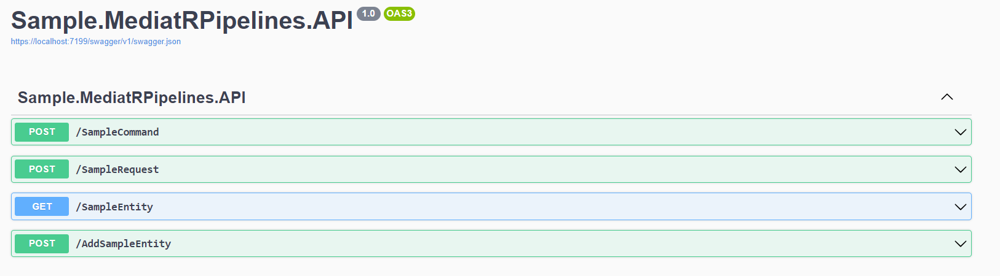

# Experimenting With MediatR Pipelines

This repository is a playground project used to experiment with MediatR features, particularly pipelines.

It also serves as the code base for the following articles:

- **C# .NET — MediatR Pipelines:**[Read on Medium](https://medium.com/@gabrieletronchin/c-net-8-mediatr-pipelines-edcc9ae8224b)
- **C# .NET — Unit Of Work Pattern with MediatR Pipeline:**[Read on Medium](https://medium.com/@gabrieletronchin/c-net-8-unit-of-work-pattern-with-mediatr-pipeline-d7a374df3dcb)
- **C# .NET — Handle Exceptions with MediatR:**[Read on Medium](https://medium.com/@gabrieletronchin/c-net-8-handle-exceptions-with-mediatr-48cbf80bae4e)
- **C# .NET — Stream Request and Pipeline With MediatR:**[Read on Medium](https://medium.com/@gabrieletronchin/c-net-8-stream-request-and-pipeline-with-mediatr-a26ddb911b39)
- **C# .NET — Stream Request and Pipeline With MediatR:**[Read on Medium](https://blog.devgenius.io/c-net-caching-requests-with-mediatr-pipeline-44a7b92f9978)
- **C# .NET — Caching Requests With MediatR Pipeline:**[Read on Medium](https://medium.com/@gabrieletronchin/c-net-8-mediatr-notifications-and-notification-publisher-b72a36f0e9ee)

## Introduction to MediatR

MediatR, available as a NuGet package for .NET, embodies the mediator design pattern, a strategy aimed at decoupling communication between objects.

For a comprehensive understanding of this pattern, you can refer to the following resource: [Refactoring Guru - Mediator Design Pattern](https://refactoring.guru/design-patterns/mediator).

A well-established implementation of this pattern for .NET is MediatR, whose official GitHub project can be found [here](https://github.com/jbogard/MediatR).

## Fundamentals of MediatR

In essence, MediatR operates across three primary modes:

- **Request:** Involves a single receiver with a service response.
- **Notification:** Engages multiple receivers without a service response.
- **StreamRequest:** Utilizes a single receiver for stream operations with a service response.

For the scope of this project, our focus is primarily on the Request behavior, particularly on exploring MediatR Pipelines.

## MediatR Pipelines

Within the mediator request flow, there exists a clear distinction between a publisher and a subscriber. By leveraging MediatR pipelines, we can effectively intercept this flow and introduce customized logic into the process.

## MediatR Pipeline Use Cases

The use cases of MediatR pipelines are numerous, and they could include:

- **Logging:** Use pipelines to log relevant information about requests, responses, or execution time.
- **Caching:** Implementing a caching pipeline alongside requests can minimize database access, especially if you are using MediatR requests to retrieve information.
- **Request Validation:** Integrating logic for validating input data before request execution ensures that only valid data is processed.
- **Unit of Work Pattern:** Utilizing a pipeline to manage the unit of work facilitates transaction handling and rollback operations in a centralized manner.

## Testing the Application

When starting the application, the Swagger page will appear:

