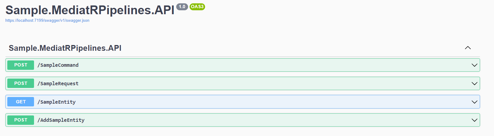

# Experimenting With MediatR Pipelines

This repository is a playground project used to experiment with MediatR features, particularly pipelines. It covers request/response handling, notifications, stream requests, exception handling, caching, and the Unit of Work pattern — all implemented through MediatR pipeline behaviors.

Detailed documentation for each topic is available in the [`docs/`](docs/) folder. The sections below provide a brief overview with links to the full documentation.

## Table of Contents

- [Package Versions](#package-versions)
- [Project Structure](#project-structure)
- [MediatR Fundamentals](#mediatr-fundamentals)
- [Topics](#topics)
  - [Pipelines](docs/pipelines.md)
  - [Unit of Work](docs/unit-of-work.md)
  - [Exception Handling](docs/exception-handling.md)
  - [Global Exception Handling](docs/global-exception-handling.md)
  - [Notifications and Notification Publishers](docs/notifications.md)
  - [Priority Notification Publisher](docs/priority-notification-publisher.md)
  - [Stream Requests and Stream Pipelines](docs/stream-requests.md)
  - [Caching Pipeline](docs/caching.md)
- [Medium Articles](#medium-articles)
- [Swagger Endpoints](#swagger-endpoints)
- [Testing the API](#testing-the-api)
- [Getting Started](#getting-started)

## Package Versions

This project targets **.NET 10** (LTS) and uses **MediatR 12.5.0**, which is the last version released under the free **Apache-2.0** license. Versions 13.0 and above use the commercial RPL-1.5 license and are intentionally not used here.

| Package | Version | Notes |
|---------|---------|-------|
| .NET | 10.0 | Long-Term Support (LTS) |
| MediatR | 12.5.0 | Last free Apache-2.0 version |
| FluentValidation | 12.1.1 | Request validation in pipeline behaviors |
| ZiggyCreatures.FusionCache | 2.6.0 | Caching layer for query requests |
| Swashbuckle.AspNetCore | 10.1.7 | Swagger UI and OpenAPI support |
| Bogus | 35.6.5 | Fake data generation for the auth service |
| Microsoft.AspNetCore.OpenApi | 10.0.6 | OpenAPI metadata |
| Microsoft.EntityFrameworkCore.InMemory | 10.0.6 | In-memory database for persistence |

## Project Structure

The solution is organized into six projects, each with a distinct responsibility:

| Project | Description |
|---------|-------------|
| **MediatR.Playground.API** | ASP.NET Core Web API that exposes REST endpoints via Swagger. Maps HTTP requests to MediatR commands, queries, notifications, and stream requests. |
| **MediatR.Playground.Domain** | Contains command/query/notification handlers, exception handlers, custom notification publishers, and the service registration logic. This is where MediatR handlers live. |
| **MediatR.Playground.Model** | Defines the models, commands, queries, notifications, and the marker interfaces (`ICommand`, `IQueryRequest`, `ITransactionCommand`) used for pipeline filtering. |
| **MediatR.Playground.Pipelines** | Implements all pipeline behaviors: logging, validation, authorization, caching, Unit of Work, and stream pipeline behaviors. |
| **MediatR.Playground.Persistence** | Persistence layer using Entity Framework Core with an in-memory database. Contains the repository implementation and the Unit of Work. |
| **FakeAuth.Service** | Simulates an authentication/authorization service used by the authorization pipeline behavior and the stream filter behavior. |

## MediatR Fundamentals

MediatR, available as a NuGet package for .NET, embodies the mediator design pattern, a strategy aimed at decoupling communication between objects.

For a comprehensive understanding of this pattern, you can refer to the following resource: [Refactoring Guru - Mediator Design Pattern](https://refactoring.guru/design-patterns/mediator).

A well-established implementation of this pattern for .NET is MediatR, whose official GitHub project can be found [here](https://github.com/jbogard/MediatR).

MediatR operates across three primary modes:

- **Request:** Involves a single receiver with a service response.
- **Notification:** Engages multiple receivers without a service response.
- **StreamRequest:** Utilizes a single receiver for stream operations with a service response.

## Topics

### Pipelines

MediatR pipelines allow you to intercept the request/response flow by implementing `IPipelineBehavior`. Each behavior wraps around the handler execution, giving you hooks for pre-processing and post-processing logic. This project implements logging, validation (with FluentValidation), and authorization behaviors, all filtered to specific request types using custom marker interfaces.

→ [Full documentation](docs/pipelines.md)

### Unit of Work

The Unit of Work pattern centralizes transaction management by wrapping handler execution in a database transaction. The `UnitOfWorkBehavior` pipeline automatically begins a transaction, commits on success, and rolls back on error. Commands opt in by implementing the `ITransactionCommand` interface.

→ [Full documentation](docs/unit-of-work.md)

### Exception Handling

MediatR provides `IRequestExceptionHandler` for intercepting exceptions thrown during request processing. This project demonstrates both a catch-all handler (handles any exception for `SampleCommand`) and a specific handler (handles only `InvalidOperationException`). The `SetHandled` mechanism allows providing fallback responses instead of propagating exceptions.

→ [Full documentation](docs/exception-handling.md)

### Global Exception Handling

`GlobalExceptionHandlingBehavior` is a pipeline behavior that wraps every MediatR request in a try/catch block for centralized error logging. Unlike request-specific exception handlers, it logs and re-throws — it does not alter the response. The two approaches complement each other: global for logging, specific for fallback responses.

→ [Full documentation](docs/global-exception-handling.md)

### Notifications and Notification Publishers

MediatR supports a publish-subscribe pattern through `INotification` and `INotificationHandler`. This project implements custom notification publishers that select a delivery strategy based on the notification type: sequential (default), parallel (`IParallelNotification`), or priority-ordered (`IPriorityNotification`).

→ [Full documentation](docs/notifications.md)

### Priority Notification Publisher

The `PriorityNotificationPublisher` executes notification handlers sequentially, ordered by a priority value. Handlers implement `IPriorityNotificationHandler` to declare their execution priority. The publisher reads priority values via reflection and groups handlers accordingly — lower values run first.

→ [Full documentation](docs/priority-notification-publisher.md)

### Stream Requests and Stream Pipelines

MediatR supports streaming data retrieval through `IStreamRequest` and `IAsyncEnumerable`. Stream pipeline behaviors (`IStreamPipelineBehavior`) process elements one at a time as they flow through the stream. This project implements a generic logging behavior for all streams and a specific filter behavior that drops elements based on authorization.

→ [Full documentation](docs/stream-requests.md)

### Caching Pipeline

The caching pipeline intercepts query requests and stores their results using FusionCache. A single `CachingBehavior` handles caching for all queries that implement `IQueryRequest`, keeping handlers focused on data retrieval while caching is managed transparently at the pipeline level.

→ [Full documentation](docs/caching.md)

## Medium Articles

This repository serves as the code base for the following articles:

- **C# .NET — MediatR Pipelines:** [Read on Medium](https://medium.com/@gabrieletronchin/c-net-8-mediatr-pipelines-edcc9ae8224b)
- **C# .NET — Unit Of Work Pattern with MediatR Pipeline:** [Read on Medium](https://medium.com/@gabrieletronchin/c-net-8-unit-of-work-pattern-with-mediatr-pipeline-d7a374df3dcb)
- **C# .NET — Handle Exceptions with MediatR:** [Read on Medium](https://medium.com/@gabrieletronchin/c-net-8-handle-exceptions-with-mediatr-48cbf80bae4e) *(covers both request-specific and global exception handling)*
- **C# .NET — MediatR Notifications and Notification Publisher:** [Read on Medium](https://medium.com/@gabrieletronchin/c-net-8-mediatr-notifications-and-notification-publisher-b72a36f0e9ee)
- **C# .NET — Stream Request and Pipeline With MediatR:** [Read on Medium](https://medium.com/@gabrieletronchin/c-net-8-stream-request-and-pipeline-with-mediatr-a26ddb911b39)
- **C# .NET — Caching Requests With MediatR Pipeline:** [Read on Medium](https://blog.devgenius.io/c-net-caching-requests-with-mediatr-pipeline-44a7b92f9978)

## Swagger Endpoints

The API exposes the following endpoint groups through Swagger:

### Requests Endpoints

| Method | Endpoint | Description |
|--------|----------|-------------|
| POST | `/Requests/SampleCommand` | Sends a sample command through the pipeline (logging, validation, authorization) |
| POST | `/Requests/SampleRequest` | Sends a sample request through the pipeline |

### Transaction Requests Endpoints

| Method | Endpoint | Description |
|--------|----------|-------------|
| GET | `/TransactionRequests/SampleEntity` | Retrieves all sample entities |
| GET | `/TransactionRequests/SampleEntity/{id}` | Retrieves a sample entity by ID |
| POST | `/TransactionRequests/AddSampleEntity` | Adds a new sample entity within a transaction (Unit of Work) |

### Notifications Endpoints

| Method | Endpoint | Description |
|--------|----------|-------------|
| POST | `/Notifications/SequentialNotification` | Publishes a notification with sequential delivery |
| POST | `/Notifications/ParallelNotification` | Publishes a notification with parallel delivery |
| POST | `/Notifications/SamplePriorityNotification` | Publishes a notification with priority-ordered delivery |

### Exceptions Endpoints

| Method | Endpoint | Description |
|--------|----------|-------------|
| POST | `/Exceptions/SampleCommandWithIOException` | Triggers an `InvalidOperationException` handled by the specific exception handler |
| POST | `/Exceptions/SampleCommandWithException` | Triggers a generic `Exception` handled by the catch-all exception handler |
| GET | `/Exceptions/NotFoundExceptionGlobalHandler` | Triggers a not-found scenario handled by the global exception handler |

### Stream Requests Endpoints

| Method | Endpoint | Description |
|--------|----------|-------------|
| GET | `/StreamRequests/SampleStreamEntity` | Streams sample entities with generic logging pipeline |
| GET | `/StreamRequests/SampleStreamEntityWithPipeFilter` | Streams sample entities with authorization-based filtering pipeline |

## Testing the API

Beyond Swagger UI, the repository includes two developer tools for testing endpoints directly from your editor or terminal.

### .http File

The file [`src/MediatR.Playground.API/MediatR.Playground.API.http`](src/MediatR.Playground.API/MediatR.Playground.API.http) contains pre-built requests for every endpoint in the API, organized by group:

- **Requests** — `SampleCommand`, `SampleRequest`
- **Transaction Requests** — `GetAll`, `GetById`, `AddSampleEntity`
- **Notifications** — Sequential, Parallel, Priority
- **Exceptions** — `InvalidOperationException`, generic `Exception`, not-found global handler
- **Stream Requests** — `SampleStreamEntity`, `SampleStreamEntityWithPipeFilter`

You can run each request directly from Visual Studio, VS Code (with the REST Client extension), or Rider. The base URL defaults to `http://localhost:5005`.

### Stream Client (PowerShell)

Standard HTTP clients (browsers, Swagger, .http files) wait for the full response before displaying anything. Stream endpoints return `IAsyncEnumerable`, so elements are produced one at a time on the server side — but you won't see that behavior with a regular client.

The script [`scripts/stream-client.ps1`](scripts/stream-client.ps1) connects to the stream endpoints using `HttpCompletionOption.ResponseHeadersRead` and prints each JSON element as it arrives, with timestamps:

```powershell
# Stream with default logging pipeline
.\scripts\stream-client.ps1

# Stream with authorization filter pipeline
.\scripts\stream-client.ps1 -Endpoint streamfilter

# Custom base URL
.\scripts\stream-client.ps1 -BaseUrl http://localhost:5050
```

Example output:

```
[14:32:01.123] Element #1 {"id":"...","name":"...","isAuthorized":true}
[14:32:01.456] Element #2 {"id":"...","name":"...","isAuthorized":false}
[14:32:01.789] Element #3 {"id":"...","name":"...","isAuthorized":true}
Stream completed. Total elements received: 3
```

This is especially useful when experimenting with the stream pipeline behaviors (`GenericStreamLoggingBehavior`, `SampleFilterStreamBehavior`) to observe how elements are logged and filtered in real time.

## Getting Started

1. Clone the repository
2. Make sure you have the [.NET 10 SDK](https://dotnet.microsoft.com/download) installed
3. Build the solution:
   ```bash
   dotnet build src/MediatR.Playground.sln
   ```
4. Run the API project:
   ```bash
   dotnet run --project src/MediatR.Playground.API
   ```
5. The Swagger page will appear at the default URL:



Use the Swagger UI to test the different endpoint groups and observe the pipeline behaviors, notification strategies, and exception handling in action. Check the application logs to see pipeline execution, notification delivery order, and exception handling output.
