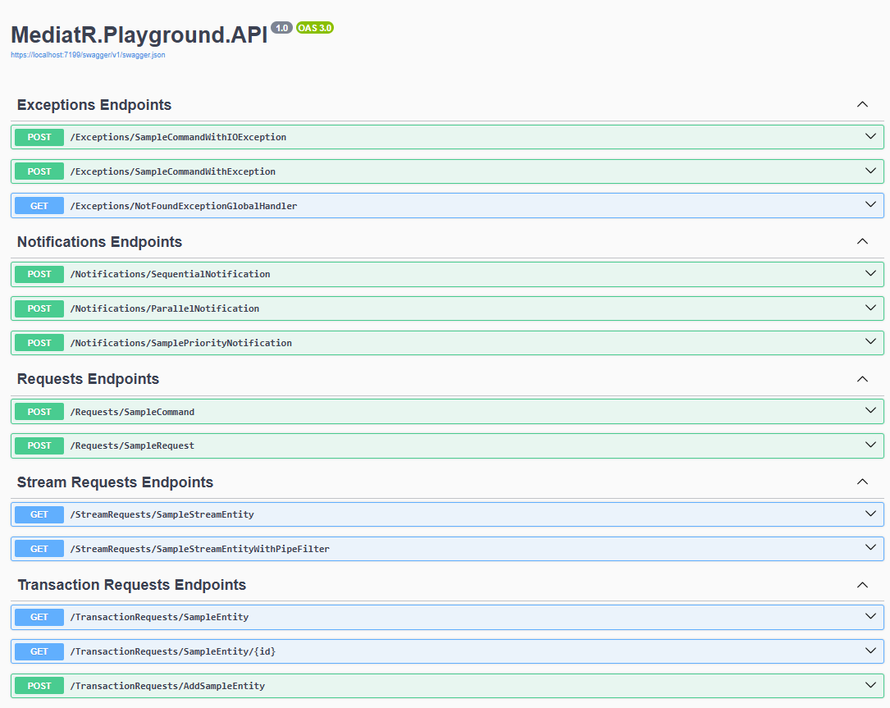

# Experimenting With MediatR Pipelines

## Introduction to MediatR

MediatR, available as a NuGet package for .NET, embodies the mediator design pattern, a strategy aimed at decoupling communication between objects.

By fostering such decoupling, MediatR enhances flexibility and maintainability within software architectures. 

For a comprehensive understanding of this pattern, you can refer to the following resource: [Refactoring Guru - Mediator Design Pattern](https://refactoring.guru/design-patterns/mediator). 

A well-established implementation of this pattern for .NET is MediatR, whose official GitHub project can be found [here](https://github.com/jbogard/MediatR).

## Fundamentals of MediatR

In essence, MediatR operates across three primary modes:

- **Request**: Involving a single receiver with a service response.
- **Notification**: Engaging multiple receivers without a service response.
- **StreamRequest**: Utilizing a single receiver for stream operations with a service response.

For the scope of this project, our focus is primarily on the Request behavior, particularly on exploring MediatR Pipelines.

## Understanding MediatR Pipelines

Within the mediator Request flow, there exists a clear distinction between a publisher and a subscriber. 
By leveraging MediatR pipelines, we can effectively intercept this flow and introduce customized logic into the process.

To implement a pipeline, one needs to inherit from the interface `IPipelineBehavior<TRequest, TResponse>`.

At this juncture, the imperative is to implement the `Handle` method, as demonstrated below:

```csharp
public async Task<TResponse> Handle(TRequest request, RequestHandlerDelegate<TResponse> next, CancellationToken cancellationToken)
{
    // Pre-processing logic

    var response = await next();

    // Post-processing logic
    
    return response;
}
```

As illustrated in the provided code snippet, this approach enables the insertion of logic both before and after invoking the subsequent step in the mediator pipeline.

Furthermore, the creation of multiple pipeline behaviors, registered in sequence, facilitates the establishment of a cohesive chain of behaviors.

```csharp
// Just register the behaviors in the order you would like them to be called.
services.AddTransient(typeof(IPipelineBehavior<,>), typeof(LoggingBehavior<,>));
services.AddTransient(typeof(IPipelineBehavior<,>), typeof(ValidationBehavior<,>));
services.AddTransient(typeof(IPipelineBehavior<,>), typeof(CommandAuthorizationBehavior<,>));
services.AddTransient(typeof(IPipelineBehavior<,>), typeof(UnitOfWorkBehavior<,>));
```

Another noteworthy technique employed in this project involves the customization of the default interface of MediatR's `IRequest`.

By inheriting the default `IRequest` interface and crafting our custom Interface, such as `ICommand`, we gain the ability to explicitly filter pipelines for specific interfaces.

Sample implementation of a custom `IRequest`:

```csharp
public interface ICommand<out TResponse> : IRequest<TResponse>
{
}
```

Sample instantiation of a pipeline tailored exclusively for `ICommand`:

```csharp
public sealed class MyPipelineBehavior<TRequest, TResponse>
    : IPipelineBehavior<TRequest, TResponse>
    where TRequest : ICommand<TResponse>
```

## Practical Application of MediatR Pipeline

Now let's delve into a practical use case for MediatR Pipelines.
In this project, you will find 4 different pipeline behaviors.

### Logging Behavior

The first use case is to log information before and after the execution of a request. 
In this use case, the pipeline logs the execution time of the request.

```csharp
public sealed class LoggingBehavior<TRequest, TResponse>
    : IPipelineBehavior<TRequest, TResponse>
    where TRequest : ICommand<TResponse>
{
    private readonly ILogger<LoggingBehavior<TRequest, TResponse>> _logger;

    public LoggingBehavior(ILogger<LoggingBehavior<TRequest, TResponse>> logger)
    {
        _logger = logger;
    }

    public async Task<TResponse> Handle(TRequest request, RequestHandlerDelegate<TResponse> next, CancellationToken cancellationToken)
    {
        Stopwatch stopwatch = new();
        _logger.LogInformation($"Handling {typeof(TRequest).Name}");
        stopwatch.Start();

        var response = await next();

        stopwatch.Stop();

        _logger.LogInformation($"Handled {typeof(TResponse).Name} in {stopwatch.ElapsedMilliseconds} ms");
        stopwatch.Reset();

        return response;
    }
}
```

### Validation Behavior

Another use case is to validate the input message request before executing the request. 
In this case, we use [FluentValidation](https://github.com/FluentValidation/FluentValidation).

```csharp
public sealed class ValidationBehavior<TRequest, TResponse>
    : IPipelineBehavior<TRequest, TResponse>
    where TRequest : ICommand<TResponse>
{
    private readonly IEnumerable<IValidator<TRequest>> _validators;

    public ValidationBehavior(IEnumerable<IValidator<TRequest>> validators)
    {
        _validators = validators;
    }

    public async Task<TResponse> Handle(
        TRequest request,
        RequestHandlerDelegate<TResponse> next,
        CancellationToken cancellationToken)
    {
        var context = new ValidationContext<TRequest>(request);

        var validationFailures = await Task.WhenAll(
            _validators.Select(validator => validator.ValidateAsync(context)));

        var errors = _validators
                 .Select(x => x.Validate(context))
                 .SelectMany(x => x.Errors)
                 .Where(x => x != null);

        if (errors.Any())
        {
            throw new ValidationException(errors);
        }

        var response = await next();

        return response;
    }
}
```

### Authorization Behavior

Similar to the validation pipeline, we can implement a custom authorization pipeline.
To do it, we inject a custom `IAuthService` and use it in the pre-processing section.

In this project, the custom `IAuthService` uses Bogus to return a random exception or not.

```csharp
public class CommandAuthorizationBehavior<TRequest, TResponse>
    : IPipelineBehavior<TRequest, TResponse>
    where TRequest : ICommand<TResponse>
{
    private readonly IAuthService _authService;

    public CommandAuthorizationBehavior(IAuthService authService)
    {
        _authService = authService;
    }

    public async Task<TResponse> Handle(TRequest request, RequestHandlerDelegate<TResponse> next, CancellationToken cancellationToken)
    {
        var response = _authService.OperationAllowed();

        if (!response.IsSuccess)
            throw response.Exception ?? new Exception();

        return await next();
    }
}
```

### Unit Of Work Behavior

The last use case is perhaps the most useful: a common pattern that we can put in place using MediatR pipeline is the Unit Of Work pattern.

To implement this use case, we inject an `IUnitOfWork` interface into the pipeline and manage the transaction inside the pipeline.

```csharp
public class UnitOfWorkBehavior<TRequest, TResponse>
    : IPipelineBehavior<TRequest, TResponse>
    where TRequest : ITransactionCommand<TResponse>
{
    private readonly IUnitOfWork _uow;
    private readonly ILogger<UnitOfWorkBehavior<TRequest, TResponse>> _logger;

    public UnitOfWorkBehavior(ILogger<UnitOfWorkBehavior<TRequest, TResponse>> logger, IUnitOfWork uow)
    {
        _uow = uow;
        _logger = logger;
    }

    public async Task<TResponse> Handle(TRequest request, RequestHandlerDelegate<TResponse> next, CancellationToken cancellationToken)
    {
        using var connection =

        await _uow.BeginTransaction();
        TResponse? response = default;
        try
        {
            response = await next();
            await _uow.Commit();
        }
        catch (Exception ex)
        {
            _logger.LogError(ex, "An error occurred on transaction.");
            await connection.RollbackAsync();
        }
        finally
        {
            connection.Dispose();
        }

        return response!;
    }
}
``` 

## Handle Exceptions with Exception Handler

Another useful feature of MediatR is the RequestExceptionHandler. With this feature, we can intercept exceptions raised from the request handler. 

By specifying the exception type on the IRequestExceptionHandler interface, you can decide which exception you are going to handle.

Here are some samples demonstrating handling a generic Exception:

```csharp
internal class SampleCommandCommonExceptionHandler
    : IRequestExceptionHandler<SampleCommand, SampleCommandComplete, Exception>
{
    private readonly ILogger<SampleCommandCommonExceptionHandler> _logger;

    public SampleCommandCommonExceptionHandler(ILogger<SampleCommandCommonExceptionHandler> logger)
    {
        _logger = logger;
    }

    public async Task Handle(
        SampleCommand request,
        Exception exception,
        RequestExceptionHandlerState<SampleCommandComplete> state,
        CancellationToken cancellationToken
    )
    {
        _logger.LogError(
            exception,
            $"---- Exception Handler: '{nameof(SampleCommandCommonExceptionHandler)}'"
        );

        state.SetHandled(new SampleCommandComplete() { Id = Guid.Empty });
    }
}
```

And here's an example of handling a typed exception, InvalidOperationException:

```csharp
internal class SampleCommandInvalidOperationExceptionHandler
    : IRequestExceptionHandler<SampleCommand, SampleCommandComplete, InvalidOperationException>
{
    private readonly ILogger<SampleCommandInvalidOperationExceptionHandler> _logger;

    public SampleCommandInvalidOperationExceptionHandler(
        ILogger<SampleCommandInvalidOperationExceptionHandler> logger
    )
    {
        _logger = logger;
    }

    public async Task Handle(
        SampleCommand request,
        InvalidOperationException exception,
        RequestExceptionHandlerState<SampleCommandComplete> state,
        CancellationToken cancellationToken
    )
    {
        _logger.LogError(
            exception,
            $"---- Exception Handler: '{nameof(SampleCommandInvalidOperationExceptionHandler)}'"
        );

        state.SetHandled(new SampleCommandComplete() { Id = Guid.Empty });
    }
}

```


## Testing the Application

Starting the application, the Swagger page will appear:



You can find 4 different endpoints:

- **SampleCommand**: Use this endpoint to test the command. This command passes through all the MediatR pipelines: Logging -> Validation -> Authorization.
- **SampleRequest**: Use this endpoint to skip all the pipelines. This works because it uses the plain `IRequest` instead of the custom `ICommand`.
- **SampleEntity**: This endpoint is useful to test the result of adding a Sample entity endpoint.
- **AddSampleEntity**: This endpoint uses `ITransactionCommand` interface and is a sample of Unit of Work pipeline behavior. In this project, it also implements a sample of the IRepository pattern using EF with an InMemory Database.

