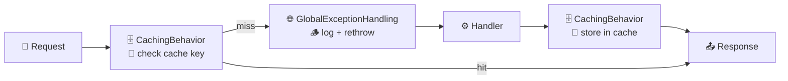
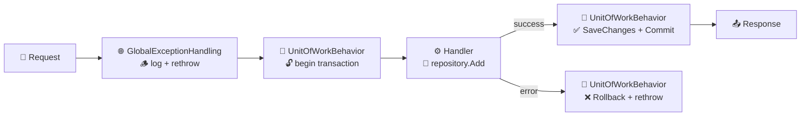
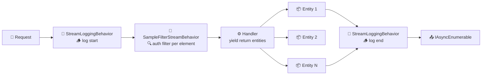
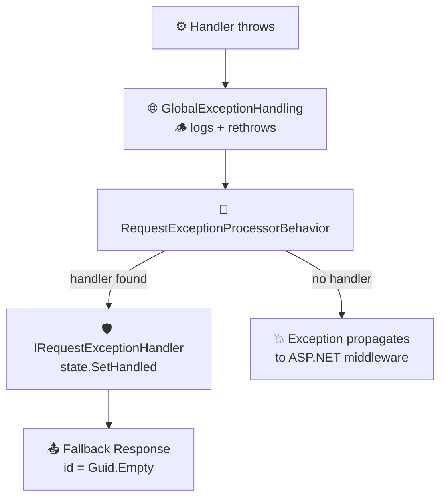

# MediatR Pipelines

> **Note:** This documentation was AI-generated based on the original article:
> [C# .NET 8 — MediatR Pipelines](https://medium.com/@gabrieletronchin/c-net-8-mediatr-pipelines-edcc9ae8224b).
> It is intended as a companion reference for the code in this repository.

## Overview

MediatR pipelines allow you to intercept the request/response flow by implementing `IPipelineBehavior<TRequest, TResponse>`. Each pipeline behavior wraps around the handler execution, giving you a hook to run logic **before** and **after** the handler processes the request.

The `Handle` method in a pipeline behavior receives the request and a `RequestHandlerDelegate<TResponse> next` delegate. Calling `await next()` invokes the next behavior in the chain (or the handler itself if it's the last behavior). Any code before `next()` runs as pre-processing; any code after runs as post-processing.

```
Request → Behavior 1 (pre) → Behavior 2 (pre) → Handler → Behavior 2 (post) → Behavior 1 (post) → Response
```

## Pipeline Flows by Request Type

Not every behavior runs for every request. The generic constraint on each behavior determines which request types it applies to. Below are the actual pipeline flows for each request type in this project.

### Command Pipeline (`ICommand<TResponse>`)

Used by: `POST /Requests/SampleCommand`

```mermaid
flowchart LR
    R[📨 Request] --> C[🗄️ CachingBehavior\n⏭️ skipped]
    C --> L[📝 LoggingBehavior\n⏱️ start stopwatch]
    L --> V[✅ ValidationBehavior\nFluentValidation]
    V --> G[🌐 GlobalExceptionHandling\n🪵 log + rethrow]
    G --> A[🔐 AuthorizationBehavior\nIAuthService check]
    A --> U[💾 UnitOfWorkBehavior\n⏭️ skipped]
    U --> H[⚙️ Handler]
    H --> RES[📤 Response]

    style C opacity:0.4
    style U opacity:0.4
```



CachingBehavior is skipped (constraint: `IQueryRequest`). UnitOfWorkBehavior is skipped (constraint: `ITransactionCommand`).

### Query Pipeline (`IQueryRequest<TResult>`)

Used by: `GET /TransactionRequests/SampleEntity`, `GET /TransactionRequests/SampleEntity/{id}`



LoggingBehavior, ValidationBehavior, AuthorizationBehavior are all skipped (constraint: `ICommand`). UnitOfWorkBehavior is skipped (constraint: `ITransactionCommand`).

### Transaction Command Pipeline (`ITransactionCommand<TResponse>`)

Used by: `POST /TransactionRequests/AddSampleEntity`



LoggingBehavior, ValidationBehavior, AuthorizationBehavior are skipped (constraint: `ICommand`). CachingBehavior is skipped (constraint: `IQueryRequest`).

### Stream Pipeline (`IStreamRequest<TResponse>`)

Used by: `GET /StreamRequests/SampleStreamEntity`, `GET /StreamRequests/SampleStreamEntityWithPipeFilter`



Stream pipelines use `IStreamPipelineBehavior` instead of `IPipelineBehavior`. Elements are processed one at a time as they flow through the stream.

### Exception Handling Flow

Used by: `POST /Exceptions/*`, `GET /Exceptions/NotFoundExceptionGlobalHandler`



The GlobalExceptionHandlingBehavior is a pure logging concern — it always rethrows. Per-request `IRequestExceptionHandler` implementations provide fallback responses for specific request+exception combinations. If no handler is registered, the exception reaches ASP.NET Core's error middleware.

## Pipeline Behaviors

### LoggingBehavior

Logs the start and end of every command execution, measuring elapsed time with a `Stopwatch`.

- **Constraint:** `where TRequest : ICommand<TResponse>` — only runs for commands
- **Pre-processing:** Logs the request type name and starts the stopwatch
- **Post-processing:** Stops the stopwatch and logs the response type name with elapsed milliseconds

Source: [`../src/MediatR.Playground.Pipelines/Command/LoggingBehavior.cs`](../src/MediatR.Playground.Pipelines/Command/LoggingBehavior.cs)

### ValidationBehavior

Validates incoming commands using FluentValidation before the handler executes. If any validation errors are found, a `ValidationException` is thrown and the handler is never called.

- **Constraint:** `where TRequest : ICommand<TResponse>` — only runs for commands
- **Pre-processing:** Runs all registered `IValidator<TRequest>` instances against the request
- **Post-processing:** None — validation is purely a pre-processing step

Source: [`../src/MediatR.Playground.Pipelines/Command/ValidationBehavior.cs`](../src/MediatR.Playground.Pipelines/Command/ValidationBehavior.cs)

### CommandAuthorizationBehavior

Checks authorization before executing a command by calling `IAuthService.OperationAlowed()`. If the authorization check fails, an exception is thrown and the handler is not invoked.

- **Constraint:** `where TRequest : ICommand<TResponse>` — only runs for commands
- **Pre-processing:** Calls the auth service and throws if the operation is not allowed
- **Post-processing:** None — authorization is purely a pre-processing step

Source: [`../src/MediatR.Playground.Pipelines/Command/CommandAuthorizationBehavior.cs`](../src/MediatR.Playground.Pipelines/Command/CommandAuthorizationBehavior.cs)

## Pipeline Filtering with Custom Interfaces

Not every pipeline behavior should run for every request. This project uses custom marker interfaces that extend `IRequest<TResponse>` to control which behaviors apply to which requests:

| Interface | Inherits From | Purpose |
|-----------|---------------|---------|
| `ICommand<TResponse>` | `IRequest<TResponse>` | Marks write operations (commands). Used by LoggingBehavior, ValidationBehavior, and CommandAuthorizationBehavior. |
| `IQueryRequest<TResult>` | `IRequest<TResult>` | Marks read operations (queries). Includes a `CacheKey` property used by CachingBehavior. |
| `ITransactionCommand<TResponse>` | `IRequest<TResponse>` | Marks commands that require transactional handling. Used by UnitOfWorkBehavior. |

By applying a `where TRequest : ICommand<TResponse>` constraint on a pipeline behavior, MediatR will only invoke that behavior for requests implementing `ICommand`. Requests that implement `IQueryRequest` or `ITransactionCommand` instead will skip those behaviors entirely. This keeps each pipeline focused on the request types it is designed to handle.

Source: [`../src/MediatR.Playground.Model/Primitives/Request/`](../src/MediatR.Playground.Model/Primitives/Request/)

## Registration Order

Pipeline behaviors are registered in the DI container as open generics. The order of registration determines the execution order — the first registered behavior is the outermost in the pipeline chain.

The current registration order in this project is:

```csharp
services.AddTransient(typeof(IPipelineBehavior<,>), typeof(CachingBehavior<,>));
services.AddTransient(typeof(IPipelineBehavior<,>), typeof(LoggingBehavior<,>));
services.AddTransient(typeof(IPipelineBehavior<,>), typeof(ValidationBehavior<,>));
services.AddTransient(typeof(IPipelineBehavior<,>), typeof(GlobalExceptionHandlingBehavior<,>));
services.AddTransient(typeof(IPipelineBehavior<,>), typeof(CommandAuthorizationBehavior<,>));
services.AddTransient(typeof(IPipelineBehavior<,>), typeof(UnitOfWorkBehavior<,>));
```

For a command request, the execution flows through the behaviors in registration order. Only behaviors whose generic constraints match the request type will actually execute. For example, a request implementing `ICommand<TResponse>` will pass through CachingBehavior (skipped — constraint doesn't match), LoggingBehavior, ValidationBehavior, GlobalExceptionHandlingBehavior, CommandAuthorizationBehavior, and then the handler.

Source: [`../src/MediatR.Playground.Domain/ServiceExtension.cs`](../src/MediatR.Playground.Domain/ServiceExtension.cs)

## Further Reading

- [C# .NET — MediatR Pipelines](https://medium.com/@gabrieletronchin/c-net-8-mediatr-pipelines-edcc9ae8224b) — Medium article covering the pipeline concepts in depth
